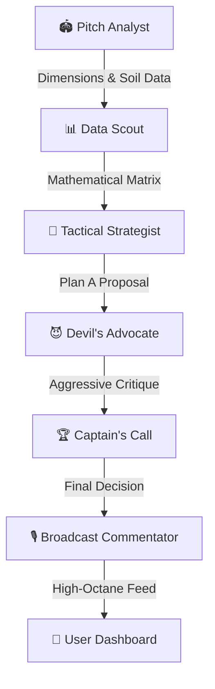

# 🌌 Google Antigravity — Agent Vibe-Coding Traces
This folder contains the agentic trace signatures of the **Google Antigravity** autonomous session that scaffolded and built **CaptainCool AI**.

## 🚀 Session Telemetry
*   **Agent Identity:** Antigravity (Google DeepMind Team)
*   **Architecture Pattern:** Sequential Multi-Agent Swarm with Mathematical Functional Tool-Calling
*   **Gemini Engine:** `gemini-2.5-pro` (Strategic Plan A Proposal & Devil's Advocate Critique) & `gemini-2.5-flash` (Pitch Analysis, Statistical Telemetry & Broadcast Commentary)
*   **Primary Workspace:** `c:\Users\patha\OneDrive\Desktop\Aryan\APL`
*   **Deployment Target:** Vercel (Production Glassmorphism Dashboard)

---

## 🧠 Multi-Agent Swarm Flow Architecture
The debate sequencing operates as a 5-phase structured dialogue:

### 1. 🏟️ Phase 1: Environment Intelligence (Pitch Analyst)
*   **Agent:** `gemini-2.5-flash` (T:0.1)
*   **Inputs:** Stadium boundary measurements (straight vs. square mismatch) and pitch conditions.
*   **Purpose:** Expose ground environmental limits to the decision matrix.

### 2. 📊 Phase 2: Telemetry Synthesis (Data Scout)
*   **Agent:** `gemini-2.5-flash` (T:0.1)
*   **Inputs:** Innings, Target, Score, Wickets, Overs, CRR, RRR.
*   **Formula Applied:** 
    $$\text{CRR} = \frac{\text{Score}}{\text{Balls Bowled} / 6}$$
    $$\text{RRR} = \frac{\text{Target} - \text{Score}}{\text{Balls Remaining} / 6}$$
    $$\text{Pressure Index} = 50 + (\text{RRR} - \text{CRR}) \times 8 + (\text{Wickets} \times 8) - \text{Stage Delay}$$

### 3. 🧠 Phase 3: Tactical Plan A (Strategist)
*   **Agent:** `gemini-2.5-pro` (T:0.65)
*   **DNA Styles:** MS Dhoni (Ice-Cold Defend), Rohit Sharma (Analytical matchups), Gautam Gambhir (Aggressor).

### 4. 😈 Phase 4: Stress-Testing Critique (Devil's Advocate)
*   **Agent:** `gemini-2.5-pro` (T:0.75)
*   **Purpose:** Ruthlessly search for point defects in the proposed captain's setup (outfield wetness, bowler fatigue, batsman strengths).

### 5. 🏆 Phase 5: Final Call & Broadcast Commentary (Reconciliation)
*   **Agent:** `gemini-2.5-pro` (T:0.65)
*   **Output:** The final defensive bowling command, custom field modifications, and the **Counterfactual Metric** (the exact state switch that flips the win probability).

---

## 🛠️ Verification Logs
*   `npm install @google/genai` (Successful)
*   `cover_art.png` Generated with Google Imagen (Successful)
*   Vercel Single-Page-App routing configuration (Successful)
