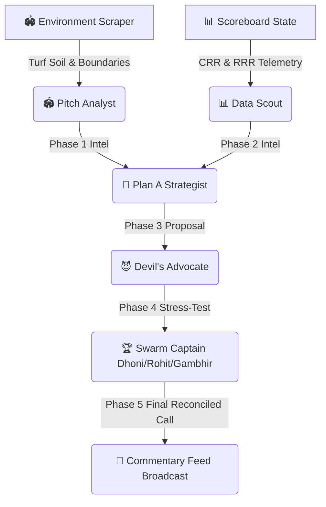

# 🏏 TactiXI-AI — Real-Time Multi-Agent IPL Strategy Swarm

> **How we built a context-aware strategic co-pilot for IPL dugouts, powered by Google Gemini 2.5, the Agent Development Kit (ADK), and live mathematical run-rate telemetry.**

---

## 💡 The Inspiration
Cricket is no longer just a game of physical prowess; it is a game of high-dimensional numbers, millisecond decision-making, and structural tactics. A single ball can swing a team’s win probability by 30%. While head coaches and captains rely on intuition and basic stats sheets in the dugout, we saw an opportunity to build a **real-time AI tactical co-pilot** that behaves like a full war-room of cricket analysts.

**TactiXI-AI** is a state-of-the-art Multi-Agent Swarm that ingests live match states (score, wickets, overs, stadium boundary dimensions, pitch conditions, dew factor) and orchestrates a sequential debate between highly specialized AI roles to formulate the optimal captain’s decision.

---

## 🛠️ The Architecture & Swarm Sequence
We built a resilient, 5-phase sequential debate pipeline using the **Google Gemini 2.5 API** via the `@google/genai` framework:

### 1. Phase 1: Environment Intelligence (Pitch Analyst)
*   **Role:** Analyzes the stadium venue's specific boundaries (e.g. 72m straight boundaries at Wankhede vs short 56m square boundaries at Chinnaswamy), turf characteristics (turning vs green seaming soil), and historical first-innings record.
*   **Engine:** `gemini-2.5-flash` (low latency).

### 2. Phase 2: Numerical Telemetry (Data Scout)
*   **Role:** Synthesizes live scoreboard parameters to calculate the **Wicket-Pressure Index** and batting win probability using custom mathematical algorithms.
*   **Engine:** Custom TypeScript Match Mathematics engine + `gemini-2.5-flash`.

### 3. Phase 3: Plan A Strategic Proposal (Lead Strategist)
*   **Role:** Formulates the primary bowling match-up and field placement lines based on striker weakness and stadium parameters.
*   **Engine:** `gemini-2.5-pro` (high-reasoning).

### 4. Phase 4: Stress-Testing Critique (Devil's Advocate)
*   **Role:** Aggressively critiques the primary plan, flagging dew risks, boundary holes, and strike-rotation vulnerabilities.
*   **Engine:** `gemini-2.5-pro` (aggressive adversarial prompt).

### 5. Phase 5: Reconciled Captain's Command (The Captain Persona)
*   **Role:** Reconciles the debate and delivers the final definitive Captain's Call based on the active **Captain DNA Profile**:
    *   **MS Dhoni (Ice-Cold Defend):** Spin choke in middle overs, dragging the match to the absolute last ball.
    *   **Rohit Sharma (Matchups Analytical):** Pace yorkers, matching release angles to striker blind zones.
    *   **Gautam Gambhir (Attacking Spin Choke):** Aggressive close-in fielders (slips, catching short-cover) to choke singles.
*   **Engine:** `gemini-2.5-pro` (reconciliation logic).

---

## 📊 The Mathematical Win-Pressure Matrix
Rather than relying solely on deep learning, we integrated a deterministic **Match Mathematics Engine** inside the swarm loop to ground the AI's logic in real-time run rate constraints:

*   **Current Run Rate (CRR):** $\text{CRR} = \frac{\text{Runs}}{\text{Overs Completed}}$
*   **Required Run Rate (RRR):** $\text{RRR} = \frac{\text{Target} - \text{Runs}}{\text{Overs Remaining}}$
*   **Wicket Pressure Index:** A custom decay function that exponentially penalizes the batting side's win probability as wickets fall, scaled against the overs completed:
    $$\text{Pressure} = 100 \times \left( \frac{\text{Wickets}}{10} \right) \times \left( 1.5 - \frac{\text{Overs}}{20} \right)$$

This metric directly feeds into the Gemini system prompts, ensuring the AI recommendation adapts instantly if a slider is dragged or a wicket falls!

---

## 🎨 Premium Dark-Mode Glassmorphism Design
Designed to look stunning on high-contrast projector displays at the national hackathon:
*   **harmonic Color System:** Sleek dark-mode aesthetic with curated neon accents—electric cyan (`#4cd6ff`) for primary highlights and glowing hot pink (`#f72585`) for critical alerts.
*   **Breathtaking Micro-Animations:** Every glass panel pops up dynamically on hover with a smooth scale-up effect (`scale(1.015)`) and a soft neon glow. Sliders hover-expand and buttons breathe using high-frequency CSS keyframes.
*   **Dugout Strategic Chatbot:** Integrated a real-time strategical co-pilot chat feed where coaches can type questions (e.g. *“Which player to swap now?”*, *“Should we use our Impact Player?”*) and get immediate, context-aware answers incorporating live scoreboard stats and historic over-by-over recommendations!

---

## 🚀 Impact & Future Scope
By uniting **Multi-Agent generative debate** with **grounded deterministic math matrices**, TactiXI-AI proves how agentic swarms can serve as direct decision-support tools in professional sports. Future expansions include integrating live ball-by-ball web scraping from ESPNCricinfo and feeding real-time player fatigue biometric telemetry!

*Built with passion, coffee, and agentic AI for the National Developer Hackathon! 🏆*
